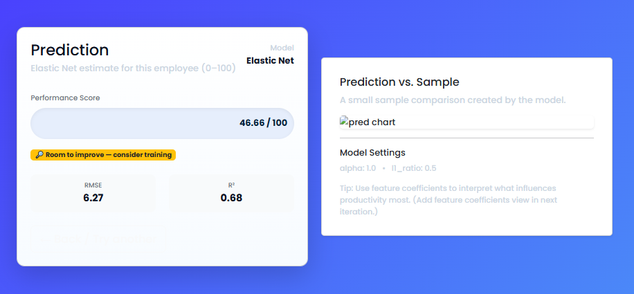

# Crop Recommendation using Decision Tree Classifier

<<<<<<< HEAD
##  Project Overview
This project predicts the most suitable crop for cultivation based on soil and environmental parameters.
It uses a **Decision Tree Classifier** trained on the `Crop_recommendation.csv` dataset and is deployed as a **Flask web application**.

##  Objectives
=======
## 📌 Project Overview
This project predicts the most suitable crop for cultivation based on soil and environmental parameters.
It uses a **Decision Tree Classifier** trained on the `Crop_recommendation.csv` dataset and is deployed as a **Flask web application**.

## 🎯 Objectives
>>>>>>> f8f0dd1c62f4085c3bb38e0a2aecb060cf17a6ad
- Predict the crop type for given soil nutrients and climate conditions.
- Provide an interactive web form for user inputs.
- Display prediction results instantly.

<<<<<<< HEAD
##  Technologies Used
=======
## 🛠️ Technologies Used
>>>>>>> f8f0dd1c62f4085c3bb38e0a2aecb060cf17a6ad
- **Python** (pandas, scikit-learn, pickle)
- **Flask** (for web app)
- **HTML/CSS** (frontend form & styling)
- **Decision Tree Classifier** (machine learning model)

<<<<<<< HEAD
##  Project Structure
=======
## 📂 Project Structure
>>>>>>> f8f0dd1c62f4085c3bb38e0a2aecb060cf17a6ad
```
Crop-Recommendation/
│
├── app.py                     # Flask application
├── decision_tree_model.pkl    # Trained ML model
├── model/
│   └── train_model.py         # Model training script
├── dataset/
│   └── Crop_recommendation.csv # Dataset
├── templates/
│   └── index.html             # Frontend HTML
<<<<<<< HEAD
├
└── README.md                  # Project documentation
```

##  Dataset Information
=======
├── static/
│   └── style.css              # Optional CSS styling
└── README.md                  # Project documentation
```

## 📊 Dataset Information
>>>>>>> f8f0dd1c62f4085c3bb38e0a2aecb060cf17a6ad
The dataset contains the following features:
- **N** : Nitrogen content in soil
- **P** : Phosphorus content in soil
- **K** : Potassium content in soil
- **temperature** : Temperature in °C
- **humidity** : Relative humidity (%)
- **ph** : pH value of the soil
- **rainfall** : Rainfall in mm
- **label** : Type of crop

<<<<<<< HEAD
##  How to Run the Project

### 1 Clone the Repository
=======
## 🚀 How to Run the Project

### 1️⃣ Clone the Repository
>>>>>>> f8f0dd1c62f4085c3bb38e0a2aecb060cf17a6ad
```bash
git clone https://github.com/yourusername/crop-recommendation.git
cd crop-recommendation
```

<<<<<<< HEAD
### 2 Install Dependencies
=======
### 2️⃣ Install Dependencies
>>>>>>> f8f0dd1c62f4085c3bb38e0a2aecb060cf17a6ad
```bash
pip install -r requirements.txt
```

<<<<<<< HEAD
### 3 Train the Model (Optional)
=======
### 3️⃣ Train the Model (Optional)
>>>>>>> f8f0dd1c62f4085c3bb38e0a2aecb060cf17a6ad
```bash
cd model
python train_model.py
```

<<<<<<< HEAD

### 4️⃣ Run the Web App
>>>>>>> f8f0dd1c62f4085c3bb38e0a2aecb060cf17a6ad
```bash
python app.py
```
The app will run on **http://127.0.0.1:5000/**.

<<<<<<< HEAD
##  Usage
=======
##  Usage
>>>>>>> f8f0dd1c62f4085c3bb38e0a2aecb060cf17a6ad
1. Open the web app in your browser.
2. Enter values for N, P, K, temperature, humidity, pH, and rainfall.
3. Click **Predict Crop**.
4. View the predicted crop.

<<<<<<< HEAD
##  Example Screenshot

Step 1:


---------
Result page:


----------
=======


