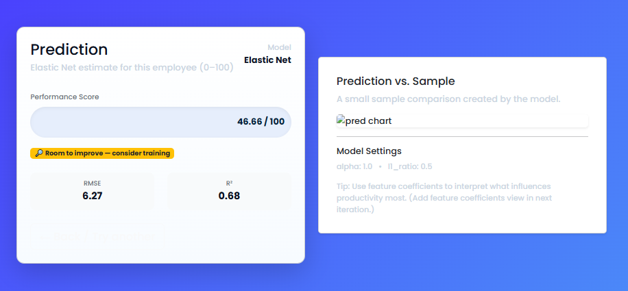

#  Crop Recommendation using Decision Tree Classifier

##  Project Overview

This project predicts the most suitable crop for cultivation based on soil and environmental parameters.
It uses a **Decision Tree Classifier** trained on the `Crop_recommendation.csv` dataset and is deployed as a **Flask web application**.

##  Objectives

* Predict the crop type for given soil nutrients and climate conditions.
* Provide an interactive web form for user inputs.
* Display prediction results instantly.

##  Technologies Used

* **Python** (pandas, scikit-learn, pickle)
* **Flask** (for web app)
* **HTML/CSS** (frontend form & styling)
* **Decision Tree Classifier** (machine learning model)

##  Project Structure

```
Crop-Recommendation/
│
├── app.py                     # Flask application
├── decision_tree_model.pkl    # Trained ML model
├── model/
│   └── train_model.py         # Model training script
├── dataset/
│   └── Crop_recommendation.csv # Dataset
├── templates/
│   └── index.html             # Frontend HTML
├              
└── README.md                  # Project documentation
```

##  Dataset Information

The dataset contains the following features:

* **N** : Nitrogen content in soil
* **P** : Phosphorus content in soil
* **K** : Potassium content in soil
* **temperature** : Temperature in °C
* **humidity** : Relative humidity (%)
* **ph** : pH value of the soil
* **rainfall** : Rainfall in mm
* **label** : Type of crop

##  How to Run the Project

### 1 Clone the Repository

```bash
git clone https://github.com/nithinskumar866/elastic_model.git
cd crop-recommendation
```

### 2 Install Dependencies

```bash
pip install -r requirements.txt
```

### 3 Train the Model (Optional)

```bash
cd model
python train_model.py
```

### 4 Run the Web App

```bash
python app.py
```

The app will run on **[http://127.0.0.1:5000/](http://127.0.0.1:5000/)**.

##  Usage

1. Open the web app in your browser.
2. Enter values for N, P, K, temperature, humidity, pH, and rainfall.
3. Click **Predict Crop**.
4. View the predicted crop.

##  Example Screenshots

**Step 1:**


**Result Page:**


---


